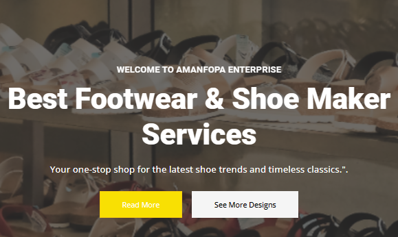
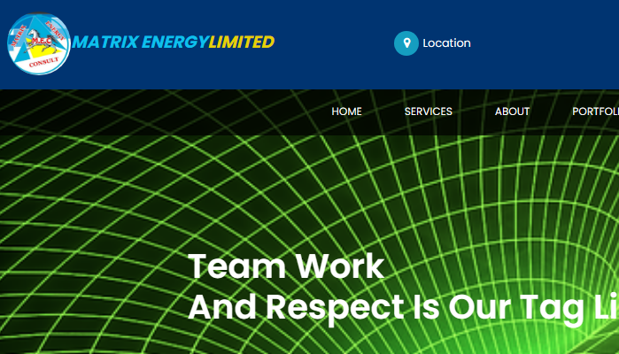
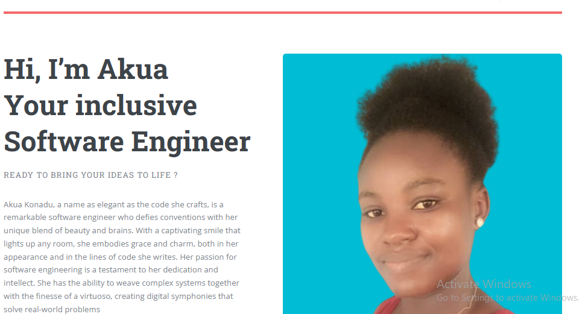

  
  
  
  
  

I'm a passionate software developer with a knack for problem-solving and a love for crafting innovative digital solutions. I specialize in coding, collaborating with cross-functional teams, and ensuring the reliability and security of software applications. With a commitment to continuous learning and a deep understanding of programming languages and development methodologies, I thrive in creating and maintaining cutting-edge software that empowers businesses and end-users.

See [my website](https://adonaitechnologies.netlify.app/) for more information!

<h1 align="center">Projects</h1>
<table bordercolor="#66b2b2">
  
  <tr>
    <td width="50%" valign="top">
      <h3 align="center">Amanfopa Shoe Factory</h3>
         
        
         
        

          
    
  
      

        
<strong>Javascript, Bootstrap, Sass, Node.js, </strong> - Platform to help customers locate and visit their factory 

    </td>
    <td width="50%" valign="top">
      <h3 align="center">Matrix Energy Company</h3>
         
      
         
        

          
  
  
      

        
<strong>Javascript,Boostrap,Sass.node.js</strong> -Similar website like Amanfopa.designes for custmers to get easy access to Matrix Energy.

    </td>
  </tr>
  
  <tr>
    <td width="50%" valign="top">
      <h3 align="center">AkuaKonadu.com</h3>
       
        
       
        

  
  
      

        
<strong>HTML5, CSS3, & Javascript</strong> - Portfolio Site including links to my projects and ways to get in contact with me.

    </td>
    <td width="50%" valign="top">
      <h3 align="center">Up Coming Project</h3>
         
        
         
        

          
  
  
      

        
<strong>HTML5, CSS3, & Javascript</strong> 

    </td>
  </tr>
</table>

<h1 align="center">Technologies</h1>

    
    
    
    
    
    
    
    
    
    
    
    
    
    
    
    
    
    
    
    

---

<h1 align="center">Connect</h1>

  
  
  
  
  

<!---
Adonai-Technologies/Adonai-Technologies is a ✨ special ✨ repository because its `README.md` (this file) appears on your GitHub profile.
You can click the Preview link to take a look at your changes.
--->
